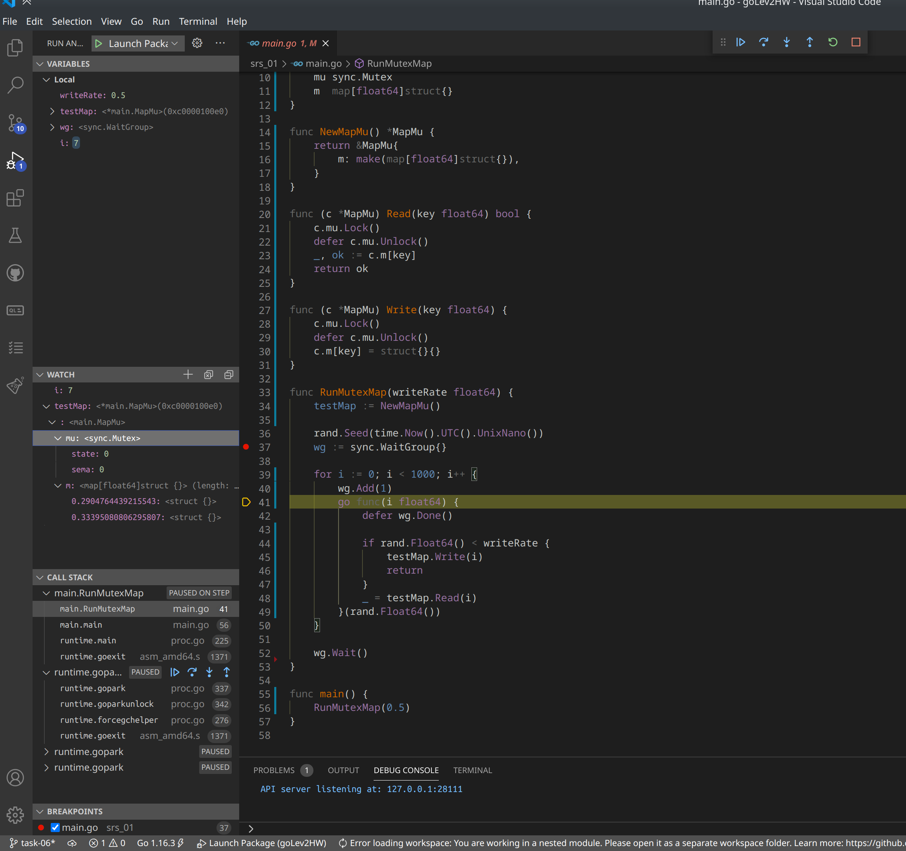
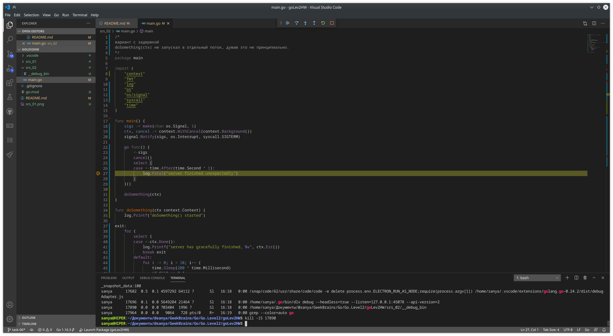
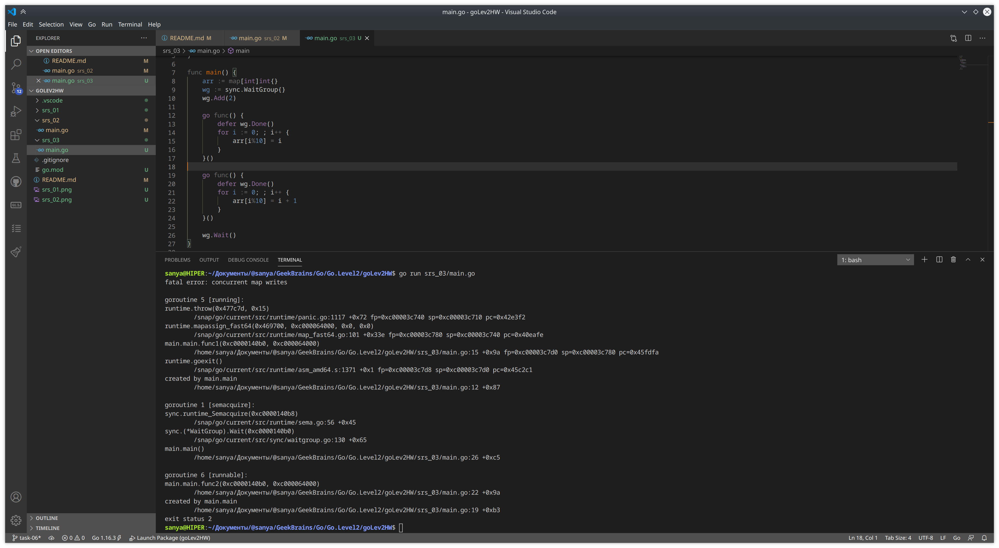

## Урок 7: Рефлексия и кодогенерация

1. Написать функцию, которая принимает на вход структуру in (struct или кастомную struct) и values map[string]interface{} (key - название поля структуры, которому нужно присвоить value этой мапы). Необходимо по значениям из мапы изменить входящую структуру in с помощью пакета reflect. Функция может возвращать только ошибку error. Написать к данной функции тесты (чем больше, тем лучше - зачтется в плюс).
2. Написать функцию, которая принимает на вход имя файла и название функции. Необходимо подсчитать в этой функции количество вызовов асинхронных функций. Результат работы должен возвращать количество вызовов int и ошибку error. Разрешается использовать только go/parser, go/ast и go/token.
3. *не обязательное*. Написать кодогенератор под какую-нибудь задачу. 

### задание 1

### задание 2

### задание 3
